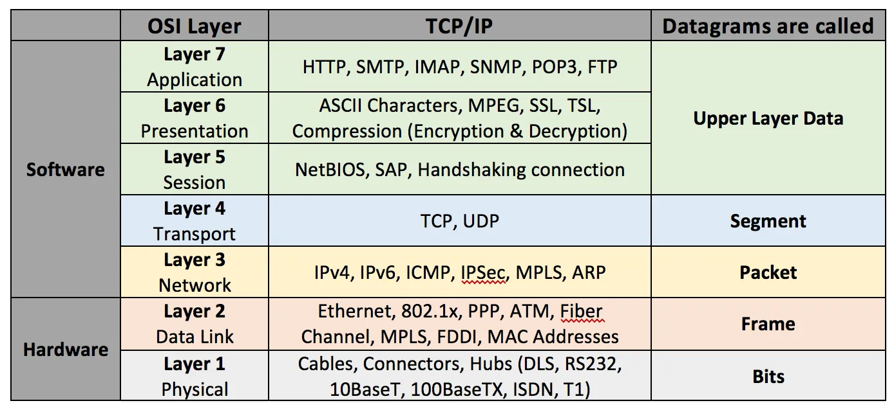
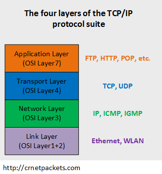
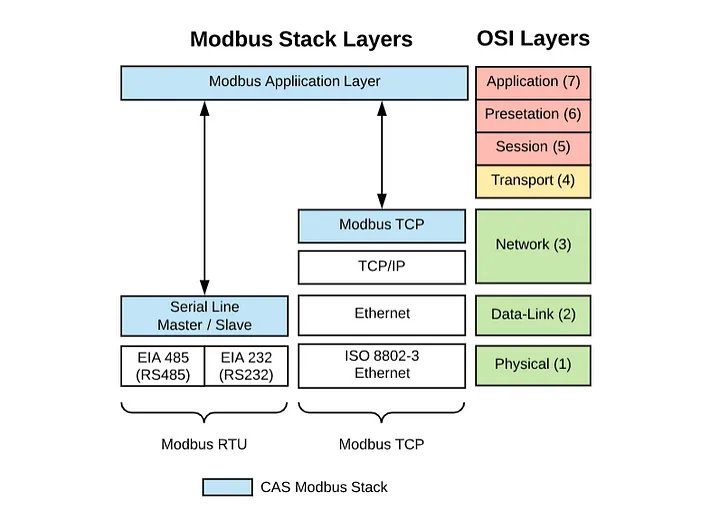
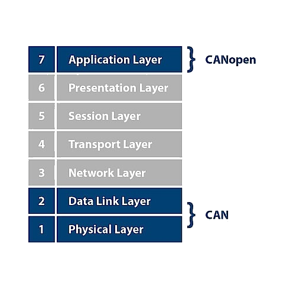

# Chapter 1 Proper Nouns
### Preface( Points ):
這個章節會先說一點專有名詞，就是那種不知道，在這領域不用混的專有名詞。然後再展開後面的項目。

專有名詞的重要性就是，在成為**明明就不懂，但是礙於年資的關係，怕被看破手腳結果遮遮掩掩的，要菜鳥做一堆Paper work的**老鳥之前的新人補充基本知識。

- [x] 簡單專有名詞解釋。
- [x] 通訊的基本觀念    
  * 模式、Protocal、OSI 7 Layer。

#### **Basic** ( 專有名詞 )
* Real Time System: 即時系統:
  * 定義: 
  系統可保證單位時間內，一定會完成任務。  
  千萬不要說即時系統是系統的Timer很準，會被笑死的。  
  如同員工經常Delay專案。但對老闆跳針的說:我們公司的打卡時鐘很準。
  <br>
  * **舉常見的生活例子**:
  * 1.開車開到一半，瞬間看到障礙物，短時間內馬上閃開稱為即時，看到障礙物已經來不及迴避，這行為稱為不即時。
  <br>
  * 2.再怎麼複雜的任務(10個 for 迴圈 )，系統都可以再1ms 內完成，不排擠到下一個任務排程，稱為即時系統。具備高度的可預測性、可規劃性。

* OSI 7 Layer:
討論到通訊的大魔王了，明明沒用到，卻處處用到。
沒用到是因為一個通訊架構不會真的切出七層來實作，但不切七層可以切四層、三層吧，因此之後出現的通訊協定( Protocal )，都是OSI 7 Layer 的變體。 用程式開發者的角度來說:
OSI 7 為抽象類別，其他的通訊皆為衍生類別。以pseudo code 舉例如下:
```csharp
public abstract class OSI_7_Layer{...}
public class TCPIP_4_Layer:OSI_7_Layer{...}
public class CANOpen_3_Layer:OSI_7_Layer{...}
public class ModbusRTU_3_Layer:OSI_7_Layer{...}
```
---
#### 通訊詳述:

通訊( Communication )的最小單元，指主客體之間的互動，這兩者負責的工作性質、用途不同，所以被賦予了不同的名詞，以便區分主客的基本性質，如: 

>* Modbus以及EtherCAT常說的Master、Slave，來區分主客。
>* TCP/IP所說的Server、Client，來區分主客。
>* CANOpen 因為只有資料的生產者跟消耗者，沒有主客這種上加階級的關係，故以Producer、Comsumer。來區分Bus 上節點(  Node )所該負責的責任。

以上，諸如此類。基於各自負責的工作性質、賦予裝置間主客之分的這件事，稱為模式( Model )。 如: Server 、Client 模式。

繼續說明通訊，下圖是TCP/IP 四層對應到OSI 7層的比較圖，相對於剛接觸通訊的小白來說，衝擊程度堪比核彈。 

因為就是不知道OSI 7層，才不知道TCP/IP 四層，用不知道的Protocal去解釋不知道的原理，結論還是不知道嘛。
 


由於，人類是以對話溝通的生物，故以對話映射到OSI 7來舉例: 

**Step 0**: 有A、B兩個人，A 為Master、B為Slave。( 賦予名詞分出主客兩者)，A要命令B，所以主人A 準備發出命令:

**Step 1**: A的使用某工具發出震動產生聲音。( 工具 = 硬體，為Physical Layer)

**Step 2**: 震動的聲音透過空氣傳達。( 聲音 = Data，空氣 = 介質，為Data Link Layer)

**Step 3**: 聲音有具備被辨識度的音色。( 被辨識度, Network Layer)

**Step 4**: 傳輸訊息的主要點是透過聲音，而聲音式兩人可接受的溝通方式。( 溝通方式 =Transport layer)。

**Step 5**: 資訊被包含在聲音中，資訊包含:音色、音調、輕重緩急的音速，一段代表命令的聲音，其中資訊的排列，應有其固定性或稱`文法`。( 文法 = Section Layer)。

**Step 6**: A發出的聲音其中的資訊，應該能讓B可以了解，了解的第一點就是，拆解一段話的文法後，可知內部有哪些式有意義的單字，而非如咳嗽聲之類的無意義聲音。( 單字 = Presentation Layer)。

**Step 7**: A、B兩者屬於同一國人，所以使用同一種語言，彼此之間也規定了使用統一語言作為溝通，方便雙方可以理解(資料解析)。故雙方的對於溝通的規定，也稱為協定。( Application Layer)。

上述以對話來舉例，看起來甚為蠻繁瑣，因此OSI 7 Layer ，通常做為一個標準模型來看待，在實作一個通訊框架時，將採用簡化OSI 7的方式，建立新的模型。如下圖OSI 7與TCP/IP 4 Layer的對應。 
即: 7 層太複雜了，四層就夠了。

* 
* 

如下圖OSI 7套用到 Modbus/RTU 3 Layer。   
* Modbus/TCP and Modbus/RTU
*   
  
* 如下圖OSI 7套用到 EtherCAT 3 Layout
* 

如下圖OSI 7套用到 CANOpen 3 Layout


其他通訊，就不再一一敘述，這邊只提出幾個工控領域常遇到的通訊。

--- 
#### Protocal( 協定 )
接收到一串帶有Data的Message時，根據`XXX 機制`去解析訊息中的資料。`XXX 機制`就是所謂的協定。

人可以發出聲音，誰先發出聲音，不同的聲音其音色、音調、音速代表的意義，其規則由雙方所訂立，可以稱為對該聲音的協定。
簡稱: 語言。
所以說中文跟說英文的兩國人，都可以透過喉嚨發出聲音，但無法溝通，可以說是彼此的Protocal 不一樣所造成的。
以實物舉例:

* TCP/IP 負責傳收的訊息，HTTP則負責解析訊息中的資料，最後User 打開Browser瀏覽網頁。  
<br>
* Modbus/RTU 的Serial Port 負責傳收的訊息，Modbus則負責解析訊息中的資料( Ex: Coil Register)  
<br>
* CAN BUS 負責傳收的訊息，CANOpen則負責解析訊息中的資料( Ex: SDO、PDO )。
---  
### 小結:
如上述的使用OSI 7 解釋A、B之間的對話。 標準化(OSI 7)在架構通訊行為中，不可或缺的重點。

故專有名詞是理解通訊，一開始會卡關的點。理解一個新的通訊架構之前，可以先問:
- 1. 使用場景是什麼? 例如:
  -  分散式的自動化需求 => EtherCAT、Modbus
  -  車用工控   => CAN Open
  -  物聯網 IOT => HTTP/HTTPs、MQTT。
  <br>
- 2.  該通訊的協定( Protocal )依照的標準是什麼，如EtherCAT 就被ETG協會所規範，相關的標準都可以透過ETG協會的文件查詢。


---

#### Reference:
[OSI 7 Layer Image ](https://medium.com/qunabu-interactive/cycle-about-http-part-4-ea30a8b0d70c)

  <https://medium.com/@white_100/modbus-%E4%B8%BB%E5%BE%9E%E7%B5%90%E6%A7%8B-master-slave-vs-%E5%AE%A2%E6%88%B6%E4%BC%BA%E6%9C%8D%E5%99%A8%E7%B5%90%E6%A7%8B-client-server-%E6%97%A9%E9%A4%90%E5%BA%97%E9%98%BF%E5%A7%A8%E8%88%87%E5%BB%9A%E6%88%BF%E7%9A%84%E6%AD%A3%E5%A6%B9-60658daaa0a7>

<https://www.kebamerica.com/blog/5-advantages-of-using-ethercat-for-motion-control/>

<https://dewesoft.com/blog/what-is-ethercat-protocol>
