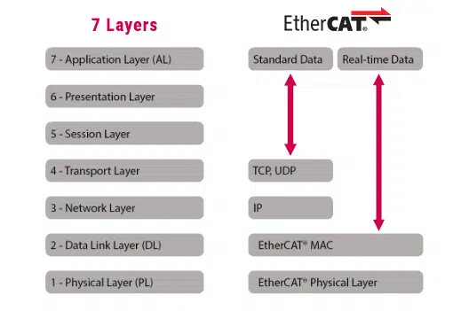
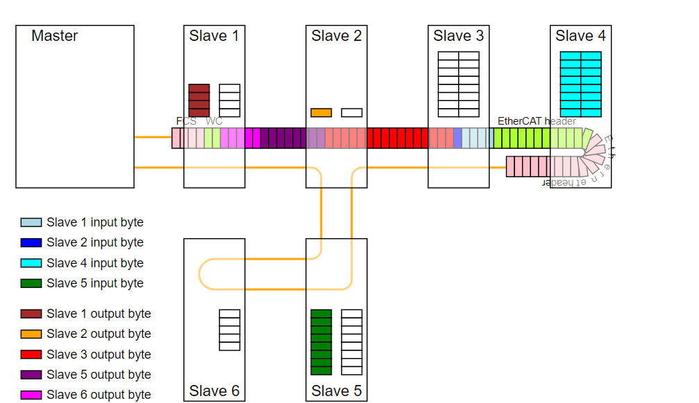
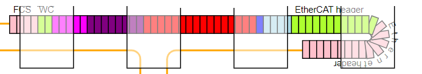
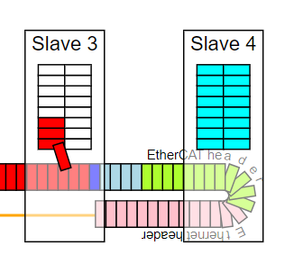

# Chapter 2 Why EtherCAT

### Preface( Points ):
物體凡存在必合理，要具備合理性，就必須先問其用途。
> **用途定義**: 在特定的環境中，可達到預期目的的作法。

用人話講:
- 我們的目的是甚麼?
- 它(物體) 可應用的環境是甚麼?
- 用它預期的好處是甚麼，有跟我們的目的有100%滿足嗎?

基於上述用人話的解釋，本文的兩個重點:
- [x] Why EtherCAT not Ethernet?   
- [x] Why use train Example to descipt EtherCAT?

(Note: **寫英文標題的理由: 避免視覺疲勞想睡覺**)

### 前情回顧:
> Chapter 1 提到了一個名詞，Real Time System。 
> * 以生活經驗的角度，來看Real Time，當一個人可以在規畫的時間內做完指派的工作，那怕工作量突然增加，也可以應付得來，就符合Real Time 的本質。
 
>* 以飛機為例，如果飛行到一半，看到障礙物飛來，此時電腦還在處理上一件事，那勢必因為來不及反應，而造成嚴重的飛安意外。
> 因此，在單位時間內做完工作，使可控性與穩定性達到預期目的，則為Real Time，例:
`1ms 內封包要送出去跟收回來`

### Why EtherCAT not Ethernet
正如前情回顧所說，Real Time 對於工控非常重要，所以通訊的即時性。成為首要考量，因此在一開始會先思考兩個點。
* a. 現階段有哪些常用的通訊架構。
* b. 這些架構中有那些是Real Time，或者是容易改成Real Time的架構。

在物聯網之前的時代，有分散式的工控需求，第一個想法就是Modbus、CAN BUS。

Modbus RTU: RS232通訊距離15m、20Kb/s，RS485則為1200m 100kB/s

Modbus TCP: TCP/IP(Ethernet )為保持資料正確性，通訊會經過三次Hand Shaking，且Server對Client發送資料，是採個別發送的方式，而非一次性的下達給所有Client。

CAN Bus 通訊距離1000m、1Mb/s、沒有主控端(Host)來控制通訊，所以採用的不是常見的Server、Client 或 Master 、Slave，而是Consumer、Producer 模式。 

綜觀上述，分散式的工控目標，Modbus RTU只有RS485的通訊距離可以接受，但資料傳輸率太小，只有100KB/s，未達GB/s的等級。
可以達到通訊距離，跟資料速率GB/s的Ethernet，由於先天的交握模式用以避免傳輸資料丟失的問題，注定是沒有Real Time 功能。

CAN Bus 作為另外一個老牌的通訊模式，在資料傳輸的效率上也未能達到GB/s。

從刪除法來看，Ethernet 除了沒有Real Time 外，其他的條件( 通訊距離、傳輸率)都滿足需求。這很像高速公路很方便，但塞車的時候( 高傳輸率 )，就很浪費時間。把高速公路打掉也很不現實，如果在上面蓋軌道做成火車，大家都在同一時間搭上火車，只要火車精準對時，這樣不就可以做到 Real Time 的需求了。
基於Ethernet、但不是Ethernet，就稱為EtherCAT吧。
OSI 7 層，直接幹到只剩2層(Physical 與 Data Link 合併唯一層)，效率提高、即時性提高。

**如果在上面蓋軌道做成火車，大家都在同一時間搭上火車，只要火車精準對時，這樣不就可以做到 Real Time 的需求了。**
=> 這也就是提到EtherCAT 時，很常用火車舉例的原因。

  
既然通訊中的資料跟傳輸方式的困點都解決了，那要依照什麼協定( Protocal )解析封包中的資料呢?
重新設計一組Protocal也很不現實，CANopen 作為應用在CAN Bus 的Protocal，也是工控( 車用領域 )常用Protocal，把CANOpen應用到EtherCAT，很合理吧，原本使用CAN Bus的客戶搞不好可以無痛轉移。

基於EtherCAT出現以下四種 Mailbox Protocal.
參考CANOpen 觀念的為下列第一項，簡稱:CoE

**CANopen over EtherCAT 簡稱 CoE。**
Servo Drive over EtherCAT 簡稱 SOE。
Ethernet over EtherCAT 簡稱 EOE。
File Access over EtherCAT 簡稱 FOE。

---

### Why use train Example to descipt EtherCAT
從下圖來逐步說明:

1. 首先要先知到主客之間為何被賦予Master、Slave，這個專有名詞，其所需負責的任務為何。 
Master: 主站，發火車( 封包 )的總站。
Slave : 從站，火車路線上的各火車站。

2. EtherCAT Package format ( 封包格式 )
Package: 火車

Max. Package Length : 火車最大總長。
與Ethernet封包長度相同1518 Byte。
火車(封包)的長度與所含的貨物(Data)成正比。若今天資料塞爆火車，讓長度超過1518 Byte.那剩下的貨物將在下一火車中發送。 
封包的格式如下，可以將每個顏色當作每節車廂，車廂的長度各有不同，可以想像，車廂中放置兩個多層的收發櫃子:  
櫃子A: 要放來自火車站( Slave )的貨物( Input data )。  
櫃子B: 要放到火車站的儲物櫃( DPRAM )中的貨物( Output Data )。

3. 車站內的儲物櫃:
火車的資料交握，簡單來說就是，把貨物(資料)從火車的櫃子，搬到火車站中的儲物櫃裡，再從儲物櫃把要運回總站的貨物，搬到火車上。
跟現實不同的是，搬資料的過程中，火車是持續移動的，以便改善延遲以及不同步的問題，因此被稱為: On The Fly

火車的貨櫃有自己的編號(邏輯位置)，車站的儲物櫃也有其編號(內存的物理位置)，兩者的編號需要互有對應，才能把貨物正確的從火車上分派給各站的儲物櫃中。

FMMU( Fieldbus Memory Management Unit )，就是把物理位置映射到封包中的邏輯位置。

Slave 內部設定有三個FMMU，用於Data Output、Data Input，MailBox 的位置配置。

Slave 內部設定有四個SM( Sync Manager )。
這是由於直接通過Slave 內存來通訊，存在著同步上的缺點，比如資料竄改。故需SM進行管理，使Master、Slave，實現安全的數據交換。
* SM1: 0x1000，用於Mailbox Output( MBoxOut )
* SM2: 0x1080，用於Mailbox Input(MBoxIn)
* SM3: 0x1100, 用於Data Output
* SM4: 0x1080, 用於Data Input
FMMU、SM就相當於火車站中，資料的管理者

而資料( 貨物 )的種類也是要被定義的，分週期性的資料 MailBox、非週期性的資料 Process Data。 這兩部分再後續章節會再說明。

目前先大致了解提到的項目就可以了:
* 主站: Master
* 從站: Slave
* 火車: 封包(Package Frame )
* 車廂形式、車廂中的收發櫃子: Package Format。
* 從站中的儲物櫃: DPRAM( Process Data 、MailBox)。
* 收發櫃與儲物櫃的位置映射: FMMU、SyncManager

---  
  ### 小結:
  目前也只說了為什麼談到EtherCAT，大家都習慣使用火車作為舉例。

  本文只是點出相關的主體的名詞，尚未說明這些主體名詞下的子名詞:  
  如 Slave 的 ESC、ENI、ESI、EEPROM、在這火車為例中代表的角色為何。
  
---

#### Reference:
[【EtherCAT】FMMU和SM简介](https://blog.csdn.net/qq_46211259/article/details/137949627?spm=1001.2101.3001.6650.1&utm_medium=distribute.pc_relevant.none-task-blog-2%7Edefault%7EYuanLiJiHua%7ECtr-1-137949627-blog-112857053.235%5Ev43%5Epc_blog_bottom_relevance_base6&depth_1-utm_source=distribute.pc_relevant.none-task-blog-2%7Edefault%7EYuanLiJiHua%7ECtr-1-137949627-blog-112857053.235%5Ev43%5Epc_blog_bottom_relevance_base6&utm_relevant_index=2)