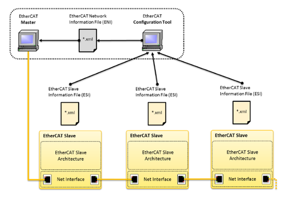
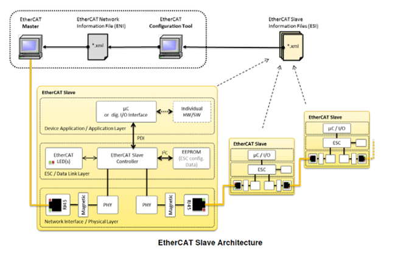

# Chapter 3  EterhCAT Files

### Preface( Points ):
你怎麼證明你的身份，他人又如何根據你的身份賦予你任務。這一點基本概念是通訊上的重點。
因為只有雙方表明身分，才能明確的協同合作。
就工程而言來看EtherCAT，就是Master、Slave。
彼此的定義清楚且明確，雙方的工作分配乾淨、合作愉快。

這邊就不討論Device 是否出現無法明確定義，但又好像很正確的身份認同。
因此如果Slave 不認為它是Slave，是一台數據機，或是Master覺得自己的靈魂的前世是台Toyota，今生的性格是GEPT全民英檢，這一類的哲學問題本文就不討論了。

本文重點
- [x] Slave 的身份說明:ESI、EEPROM
- [x] Master 掌握全局的地圖: ENI

### 前情回顧:
> Chapter 2 主要說明為什麼討論EtherCAT 的人都習慣以火車為例。

除了Master、Slave 的關係如同發車的總站以及途經的各個小站以外，封包如列車去回，資料的交握也如收發櫃跟儲物櫃的關係一樣，有物理位址( 儲物櫃的編號 )與邏輯位址( 收發櫃的編號 )的映射。

上述對於EtherCAT通訊的描述，是基於Master，已經知道接收封包的Slave是什麼裝置，這個前提之下。如果Master 不認識Slave，該怎麼談合作呢?

接著，就像兩個原本不認識的人要協同合作，一定要先對彼此有個了解，如果Master、Slave 一開始就是獨立的個體，要組成分散式的系統，我們需要先思考。

* Slave 要怎麼被Master 認識。 
* Master要怎麼認識Slave。
  
### Slave : ESC
EtherCAT 為通訊的一種形式，原本做Modbus IO的廠商，把Modbus 換成EtherCAT，就成了功能依舊，但支援EtherCAT 的IO產品。

EtheCAT 從站控制IC( ESC )，提供了數據接口並處理對應的Data Packages。 實現OSI 7 Layer 的Data Link Layer。

以上述為例，I/O 功能MCU以SPI 的方式與ESC進行通訊，就成了EtherCAT I/O 模組。

ESC這邊我們只討論暫存器相關的部分，把問題聚焦在跟資料有關的名詞身上:

* DPRAM
  *  **0x0000~0x0FFF (前4K):**
  Registers 存储底层的设置和诊断信息。例:
  常見的Error Counter 的位置 0x300。
  *  **0x1000~0xFFFF:**
  用于应用层的主从通讯 (Process Data and mailbox)。
  例:PDO的 0x1A00、SDO 的0x1000。

* FMMU:
  將封包中的Datagram的邏輯位置與DPRAM中的物理位址完成映射，處理非週期數據( Process Data)
   
* SM:( SyncManagers)
  主站與微處理器（uC）同時取用ESC的暫存器中的資料的話，SM 負責確保週期數據( Process Data )與非週期數據( MailBox )的一致性。
   
* EEPROM:這段可就重要了
  EEPROM 包含Slave Infomation: 
  包含供應商的名稱、FW、產品名稱等相關資訊。會說重要呢，是因為EEPROM 紀錄的就是Slave 可被了解的資訊。
  
  當然，有的Master 也可以藉由直接讀去Slave 的EEPROM來認識這台Slave。 但要一台一台去讀取(認識)，然後串聯出整體的分散是網絡，效率太差了。
  有沒有辦法讓Master 在之前就認識Slave?
  比如把EEPROM 匯出成為檔案，匯入Master，當Master通訊起來的時候，就可以馬上認出網絡上的Slave。
  
  有，就是ESI。在EtherCAT 系統架構，如下圖所示:
  
--- 

### Slave : ESI( EtherCAT Slave Information)
ESI 對於**配置**EtherCAT網絡至關重要。
用以描述Slave 的XML 文件。使Master可以正確的識別Slave。

理論上來說，ESI 的資訊要與Slave EEPROM內的資訊一致。若不一致需要重新更新Slave 的EEPROM或Master紀錄的ESI檔案。

當匯入網絡上所有Slave 的ESI 給Master，而Master 也確實識別出所有的Slave。
此時分散式的網絡形成了。

你可以想像，捷運藍線上的地圖已經形成，而這樣的地圖也可以存成檔案嗎?
有，就是ENI。在EtherCAT 系統架構，如下圖所示:

--- 

### Slave : ENI( EtherCAT Network Information)

想像一下，如果捷運藍線上突然不見了一站，對於掌控訊息的總站(Master) 來說應該是一件大事對吧。

Master 是跟之前的捷運圖比起來才知道少了一站，而捷運圖，就是我們要說的ENI。

ENI 是用於描述網絡的配置訊息的XML File。
包含Master 與所有Slave 的訊息，以及拓譜結構與連結方式、週期時間、同步模式...等。

因此在討論整個網路拓譜的時候，ESI、ENI 會先被拿出來討論說明，自由有其原因。

---  
  ### 小結:

  火車站( Slave )的身分資訊，記錄在EEPROM、可存成ESI供總站( Master )用於識別Slave。

  總站( Master )可以讀各站的EEPROM獲得訊息，但更有效率的方法是匯入ESI用以辨識。

  當網絡拓譜完成時，可匯出ENI File。可用於其他設備(分散式系統)完成後直接匯入，減少設定與配置的時間。
  
  截至目前，為何要用火車站比喻EtherCAT。大致上已經說明完成。

  接下來要說明的是，另一個EtherCAT 會卡關的點，資料交握。 
  
  目前我們只知道資料交握，像是從車廂的收發櫃子上，把資料搬到火車站中的儲物櫃，再從儲物櫃搬到收發櫃運回總站。
  簡單來說是如此，但實作上確實複雜得多。
  其中要討論的是資料的屬性與分類:
  **屬性**: 周期性與非週期性
  **分類**: 模組的資料要被分到哪個Index。

  後續章節會先談到週期性與非週期性的資料 `MailBox(SDOs)、Process Data (PDOs)`。

---

#### Reference:
<https://tr.beckhoff.com.cn/pluginfile.php/23701/mod_resource/content/0/TwinCAT%E6%8E%A7%E5%88%B6%E7%B3%BB%E7%BB%9F%E4%B8%ADEtherCAT%20%E7%9A%84%E7%BB%93%E6%9E%84%E5%92%8C%E6%8B%93%E6%9C%B4.pdf>