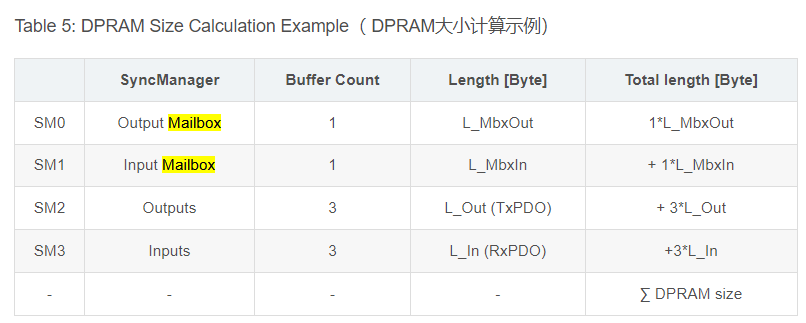

# Chapter 4 MailBox、Process Data

### Preface( Points ):
討論週期性資料，與非週期性資料的時候，須先了解。什麼叫週期性。

EtherCAT Master，設定Cycle Time為 100 us。
也就是封包保證在100 us 把資料送出予收回。
周而復始，就是週期性。

每次都在車廂收發櫃的資料 => 週期性，如Slave 的狀態。
需要才再發車前搬到收發櫃的資料=> 非週期性，如設定某個IO的ON、OFF。

至於Cycle Time 準不準，怎麼定義，就必須討論Master 與Slave 的對時機制。這邊避免節外生枝，就暫不討論啦。之後再做說明。
有興趣的人可以先看參考資料: [點擊，參考解說資料](https://blog.csdn.net/qq_37659294/article/details/130187646?ops_request_misc=%257B%2522request%255Fid%2522%253A%2522171870179716800222836693%2522%252C%2522scm%2522%253A%252220140713.130102334..%2522%257D&request_id=171870179716800222836693&biz_id=0&utm_medium=distribute.pc_search_result.none-task-blog-2~all~sobaiduend~default-1-130187646-null-null.142^v100^control&utm_term=ethercat%20dc%20SM&spm=1018.2226.3001.4187)

本文重點
- [x] MailBox、Process Data 
- [x] CANOpen

  
### MailBox 說明1
郵差會在信件放入郵箱時，一併拉起紅色旗標，屋主看到旗標的狀態為ON，就知道裡面有信，取走信件後，也會一併降下郵箱的旗標。

以上敘述可視為一次的資料交握，
在硬體上，會有一組暫存器，被用來做為Mailbox，進行設置資料或清零。
一組暫存器則用於中斷，當中斷發生時，軟體可進行處理。

Master 可以設置週期時間( Cycle Time )，封包的去回都在一個Cycle Time內做完，Cycle Time 可以想像為火車發車時間。

所以資料的發送可以是週期性發送( Process Data )，以及非週期性發送( `MailBox` )。

到目前為止，讀者應該對於MailBox大概也只有模糊的概念，`MailBox = 非週期性的資料交握`。

---

### MailBox 說明2
下圖是ESC的硬體配置，在這裡 MailBox 是一組來自DPRAM 的Registor，更確切的說:
劃分一塊Registor( 0x1000~0xFFFF ) 用於MailBox 通訊使用。

硬體上有了可以放資料的地方。所以。
* Master 會將資料寫到MailBox，待Slave 讀取。
  * > Master 會檢查WKC來確認有無寫入成功。若不成功則重發命令。
  
* Slave 會將資料寫到MailBox，待Master 讀取。
  * > Master 會透過FMMU週期性檢查MailBox中是否有資料須讀取。或透過Polling 方式確認MailBox中有無數據。

為確保資料的正確性，避免Master、Slave，同時讀寫Process、MailBox中的資料，這個工作將由SyncManagers( SM ) 負責。  

到目前為止，對於MailBox，至少有了 MailBox在ESC 的硬體架構中的哪個部分，又是如何確保資料的正確性的概念。

以下繼續說明:

---

### MailBox 說明3
為確保資料的正確性，避免Master、Slave同時讀寫Process、MailBox中的資料，這個工作將由SyncManagers( SM ) 負責。

ESC 中有4組SM:
SM0、SM1，用於 MailBox.
SM2、SM3，用於Process Data。

Master 會透過FMMU週期性檢查MailBox中是否有資料須讀取。
ESC 中有3組FMMU

到目前為止，對於MailBox的概念，至少有 MailBox是處理非週期性的資料。而週期性資料為Process Data。

在CoE ( CANOpen over EtherCAT )中，非週期性的資料為SDO、週期性的資料為PDO。會使用SDO、PDO 這兩個名稱，源於CANOpen 架構中關於Object Dictionary 的觀念。
以下繼續說明:

---

### MailBox 說明4
在前一節( MailBox 說明3)，我們是從ESC 的DPRAM出發，解釋MailBox，這屬於Data Link Layer 的項目。

接下來換個角度，從Application Layer，也就是這些Register,要塞入那些資料，又該怎麼解析資料，這個問題就涉及到Protocal。

如Chapter 2 所述，EtherCAT出現四種 Mailbox Protocal，其中最常用的為CoE。
CANOpen over EtherCAT : 就夠在EtherCAT 之上的 CANOpen。

MailBox 的資料用於非週期性、Process Data 用於週期性資料，兩者皆須定義好對應的Address。對於這種特色，剛好符合CANOpen 的基本性質。

CANOpen 有兩種OD( Object Dictionary )，一個是PDO、一個SDO。 所以PDO用在Process Data。
SDO 用於 MailBox。

因此，在CODESYS 上，SDO 的位置都從0x1000開始，SOD所在UI 上的頁面名稱為CoE Online。

在此因為尚未討論完Data Link 層的問題。所以CANOpen 的機制就不深入討論，待後續章節再做說明。

---  

### 小結:
Chapter 1 的重點在於，通訊架構的觀念 ( OSI 7 Layer。)

Chapter 2 的重點在於，工控中Protocal、Real Time的觀念。

Chapter 3 的重點在於，解釋EtherCAT 習慣用火車最為例子說明。該怎麼理解其中的對應。

Chapter 4 的重點在於，資料交握的行為模式。

接著讓我們回到火車的例子。火車站有自己的名稱( Slave Product Name )，被記錄在EEPROM、ESI中。

但在使用上的時候，Master 是以ID 進行對Slave 的操作，
如: 直接隨Slave數量而遞增的 EtherCAT Address。

如:旋轉旋鈕所設定的絕對位置:
Device ID ( 或稱 Board ID、Hardware ID)。

如直接修改EEPROM的ID的從站別名: 
Alias ID( 或稱 Software ID )。

舉例來說 ID，就像學生有自己的名字，但學校仍會給予一組學號，皆是代表同一個人，但對於學校來說，都是以學號進行操作。

至此，EtherCAT以火車為例說明前各自對應都說明完畢，以通訊層來說，Data Link Layer 的說明完畢。

之後將繼續說明Application Layer。
Apllication Layer 會從封包格式( Package Format)先談。

---

#### Reference:
<https://tr.beckhoff.com.cn/pluginfile.php/23701/mod_resource/content/0/TwinCAT%E6%8E%A7%E5%88%B6%E7%B3%BB%E7%BB%9F%E4%B8%ADEtherCAT%20%E7%9A%84%E7%BB%93%E6%9E%84%E5%92%8C%E6%8B%93%E6%9C%B4.pdf>

<https://blog.csdn.net/pwl999/article/details/109397700?ops_request_misc=&request_id=&biz_id=102&utm_term=EtherCAT%20Fixed%20Physical%20Addres&utm_medium=distribute.pc_search_result.none-task-blog-2~all~sobaiduweb~default-0-109397700.142^v100^control&spm=1018.2226.3001.4187>

<https://www.vector.com/int/en/know-how/protocols/canopen/#c54640>