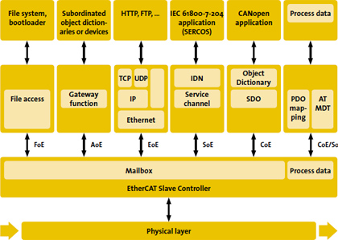

# Chapter5 EtherCAT Package

### Preface( Points ):

在製作一個櫃子，整體櫃子高度多少( 資料長度 )，要切出幾格，每一格的高度( Format )又是多少。這就是Data Link 層的Format。

到了Application 層，櫃子是要用來做書櫃、廚櫃、還是衣櫃，根據用途( Protocal )的不同，又再次對每一格的夾層，給予新的名詞。

所以釘出了一個三層書櫃，並給每層一個編號( Index )用於分類。
第一層是經常性用書，工具書名:侯捷C++、第二層是非經常性用書，如書名: 為什麼下屬不喜歡我，我覺得我很棒啊。
第三層是 散裝文件資料。

以上就是以生活例子( 櫃子 )說明從Protocal封包格式。

本文重點:
- [x] Package Fromat
--- 

### Package Format
如之前所述，EtherCAT 是基於Ethernet 架構而來，因此封包的格式基本承襲Ethernet 封包，比如EhterCAT封包的最大長度與Ethernet相同，且Ethernet 有的包含Ethernet Header、CRC。
相似但仍有不同，如下圖黃色區塊處，則是EtherCAT 資料放置的地方。

而在實際執行時，Slave 將資料塞到封包中的形式如下，簡而言之，就是把資料塞到名為Datagram的資料區塊中:

至於要以何種形式( Protocal )，編排與解析資料，如前所述，EtherCAT 有四種MailBox Protocal。
其中CoE( CANOpen over EtherCAT )常用。
如下圖左邊兩個區塊，分別表述
SDO: 非週期性資料。
PDO: 週期性資料。也就是Slave DPRAN 中的Process Data 暫存器區中的資料。
在CoE 中的表述。

Process Data ( PDO )不一定是CoE Protocal，也可以是SoE Protocal。 
`Servo drive profile according to IEC 61800-7-204 (SoE)`

簡單來說就是用於伺服控制的Protocal，這邊就不贅述了，等到CiA402時，談到ETG 標準的規範文件，再一併做說明。

這邊先了解，Slave在DPRAM 中的兩塊資料，MailBox、Process Data，是以CANOpen 規定的形式，塞到封包中的Datagram 裡面。
CANOpen 中名為SDO 的資料 用於MailBox 這種非週期性的資料。

CANOpen 中名為PDO 的資料 用於Process Data 週期性的資料。

至於 DPRAM 的物理位置、與封包的邏輯位置，怎麼映射就是FMMU的工作範圍。

在Master、Slave 讀寫同一暫存器(位置)時可確保資料正確，就是SM( SyncManager )的工作範圍。

封包格式大致上知道概念後，接下來的問題就會著重在應用上。比如
* 1. Master與Slave 開始通訊時，要怎麼知道Slave 已經可以接受命令，準備開始工作了?
  
* 2. 那麼通訊要應用在哪種工控領域上?
  
* 3. 根據不同的領域，在OD中，有哪些Object 的名稱、以及Index 是被保留給這領域中的專有名詞使用?
*  4. 以上三點問題，需先知道ETG 協會的規範是那些，這就排到進階的章節裡面去好了。

先把最後初學教程的最後一片拼圖補上: CANOpen。

需先說明CANOpen的理由 ，是因為相關的專有名詞及其觀念都從這裡來。如:
* Object Dictionary ( OD )
* Service Data Objects (SDOs)
* Process Data Objects (PDOs)
  
正因為EtherCAT在觀念上融入了Ethernet 、CANOpen。因此名詞造成的混淆，是初學者望之卻步的原因。

---  
### 小結:
此段小結在Chapter 0說過，因為重要，所以重複第二次。

EtherCAT 的觀念並不難懂，一個具有即時性的封包，在Cycle Time 內，封包一去一回，告知Slave 的工作，並讀取各站Slave 的資料，Slave 則是收到資料之後開始各自工作。

在實際應用上( 單純只是要用的話 )，只要知道如何設定Cycle Time、同步模式、PDO、SDO即可，並不需要特別的知識。

但如果要分析封包乃至於原理，EtherCAT 難懂的地方在於，在搞懂EtherCAT 之前需先具備:

* 需要對 通訊觀念有一定的基礎。
  * 能理解 OSI 7 Layer
  * Protocal 對應到OSI 7 Layer 的理解力。
* 需要對 Protocal的觀念有一定基礎。
  * CANOpen。
  * Package Format。
* 需要對 硬體架構方塊圖的閱讀能力。
  * 例如: Slave ESC Function Block。
  * Hardware register for what。
* 需要對 工控領域有一定的應用經驗。
  * What Real Time System.
  * Redundency、Server Drive、DIO/AIO。
  * 官方文件的閱讀能力，如ETG。

若遇到腰很好的同仁，滿口說:簡單簡單。
呷無三把蕹菜，欲上西天的那種，非蠢即壞。

當然啦，看到這裡還不知道我在寫什麼的。比如OSI 7 Layer。

你可能發現了一個事實，這系列文章並不是給白紙看的，而是有幾年工控經驗的人，作為溫故知新用的。

---

#### Reference:
<https://blog.csdn.net/qq_37659294/article/details/130187646?ops_request_misc=%257B%2522request%255Fid%2522%253A%2522171870179716800222836693%2522%252C%2522scm%2522%253A%252220140713.130102334..%2522%257D&request_id=171870179716800222836693&biz_id=0&utm_medium=distribute.pc_search_result.none-task-blog-2~all~sobaiduend~default-1-130187646-null-null.142^v100^control&utm_term=ethercat%20dc%20SM&spm=1018.2226.3001.4187>

<https://ethercatcpp.lirmm.net/ethercatcpp-framework/pages/ethercat_details.html>

<https://www.ethercat.org/en/technology.html>

<https://www.motorpowerco.com/media/rujb5gmc/ethercat_canopen_manual_duetad_v1_1.pdf>