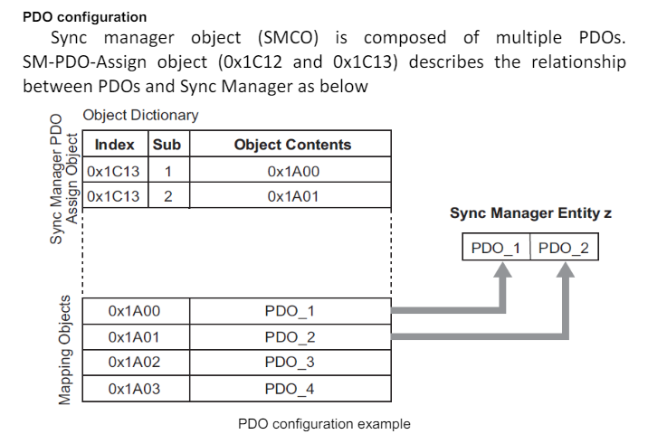
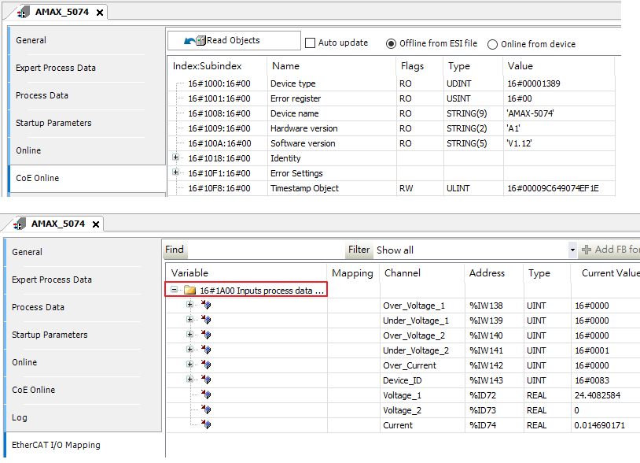

# Chapter6 CANOpen

### Preface( Points ):
本文算是輕鬆小品，以白話來說，不會就算了，也不會世界末日，但如果到這一章還沒有OSI 7 的基本觀念，可是會落入北斗神拳世紀末的那種窘境。

本文重點:
- [x] 溫故知新
 
### CANOpen
CANOpen 於OSI 7的對應如下。
是架構在CANBus 通訊上的一種Protocal。
如同: Modbus RTU，是架構在Serial Port 通訊上的Modbus Protocal。

CANBus的通訊方式如下(系統):

上圖，如果沒有接過CANBus的朋友，應該會覺得陌生，個人建議，去找兩顆模組試一下吧，這個東西就是試了就會，一直看下去也不是辦法。

---

通訊架構有了、接線有了，接著討論CANOpen 的封包。
封包格式如下，在此先說明，下圖跟要說的CoE 沒甚麼關係，但想拿來表述一個基本觀念。

資料的單位長度是Byte，Data Format，就像在製作一個櫃子，整體櫃子高度多少( 資料長度 )，要切出幾格，每一格的高度( Format )又是多少。這就是Data Link 層的Format。

到了Application 層，櫃子是要用來做書櫃、廚櫃、還是衣櫃，根據用途( Protocal )的不同，又再次對每一格的夾層，給予新的名詞。

這也就是把CAN Data Format 與CANOpen Format兩並列一起的原因。

然而，我們真正要從CANOpen獲得的是Object Dictionary( OD )這個觀念。 因為CoE就是根據觀念進行資料的交握。 而在CANOpen 用於密免資料碰撞的CAN-ID，EtherCAT 則沒有採用。

**CANOpen Device Structure:**

簡而言之，EtherCAT的資料交握，本質上就是，資料必須放到正確的位置上，由於OD 對於資料應該放在哪個Index 有明確的定義，因此在討論MailBox、Process Data 的時候，會使用SDO、PDO，Index、這個在CANOpen中OD 相關的名詞，以及引用其行為也不意外了。

如下圖:
(1) 為 CANOpen所定義的 TXPDO、RXPDO 的Mapping到OD的位置。
(2) 為 EtherCAT，TXPDO、RXPDO、Mapping 到DPRAM物理位置。

### CANOpen: Object Dictionary
從這也可以看得出，源於Object Dictioanry的概念，故可解釋，操作EtherCAT的資料時，經常提到資料應該要位於哪個Index。

再回到之前講述，以櫃子解釋封包格式( Package Format )的例子。
* Step 1: 櫃子 -> 根據用途 -> 書櫃
* Step 2: 書櫃 -> 根據種類 -> 書籍按類別放在對應編號的格子中。
* Step 3: 從編號1的書格 -> 挑選要看多本的書 -> 放到書桌的書架上。( Note，書櫃的編號與書架的編號，是相對應的)

Step 1 說明了封包的格式，Step 2 解釋了Data(SDO，PDO) 映射到 暫存器中，書格編號就是Index。
Step 3 解釋資料Mapping。

下圖為CANOpen 的PDO Mapping:
其結構相當的單純，資料( Object )，都有其對應的索引(Index )。

下圖為EtherCAT 的PDO Mapping:
其OD的結構與上述略有不同，因為需要確保資料的正確性。故在SyncManager紀錄PDO 的Index。
其後才根據Index 找到所需要的資料( PDO Object )。

在操作上，使用者只須知道0x1A00相關的位置觀念即可。如下使用CODESYS 讀取Advantech AMAX-5074 的SDO、PDO。

---  
### 小結:
這邊主要引出一個重要的觀念OD( Object Dictionary )，資料都有其對應的索引位置，OD的觀念來自於CANOpen，EtherCAT基於此Protocal的觀念應用於EtherCAT通訊上，故略有不同，稱CoE。

至此，補上最後一塊知識拼圖，如這一系列一開始所述，EtherCAT 牽涉的範圍甚廣，這邊只概述一些重點，還有很多的觀念這邊沒說，以避免自亂陣腳，如:

1. 對時機制( DC Mode 、SM Mode)。
2. State Machine。( Init、PreOP、Safe Op、OP)
3. EtherCAT Diagnostics。( 偵錯與排錯 )
4. ETG 規範( Cia 402 、PP Mode 、CSP Mode)
5. EtehrCAT Package Analysis。

---
### Level 1 Tutorial : Completed

---
#### Reference:
<https://wiki.csie.ncku.edu.tw/embedded/CAN>

<https://www.ni.com/en/shop/seamlessly-connect-to-third-party-devices-and-supervisory-system/the-basics-of-canopen.html>

<read://https_gitcode.csdn.net/?url=https%3A%2F%2Fgitcode.csdn.net%2F65eec9261a836825ed79d758.html>

<https://www.anaheimautomation.com/manuals/servo/L011665%20-%20EtherCAT%20User%20Manual_V1.06.pdf>

https://www.can-cia.org/can-knowledge/pdo-protocol