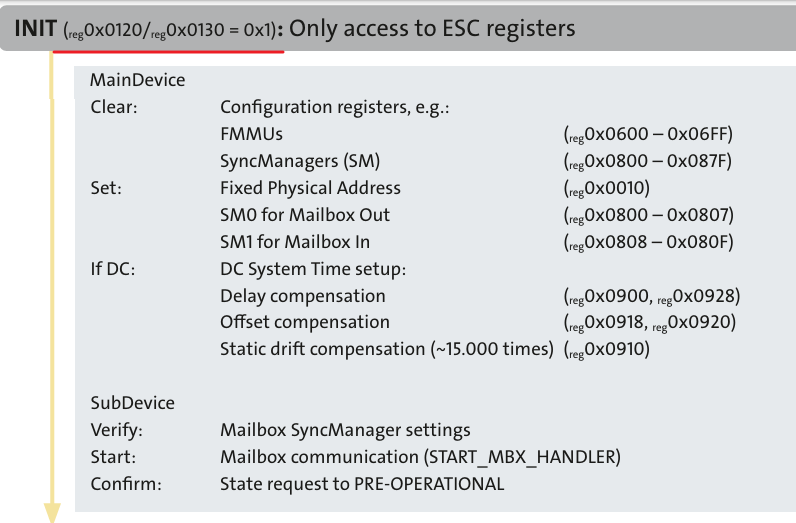
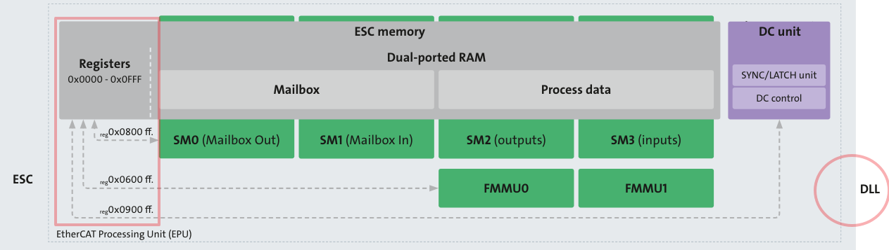
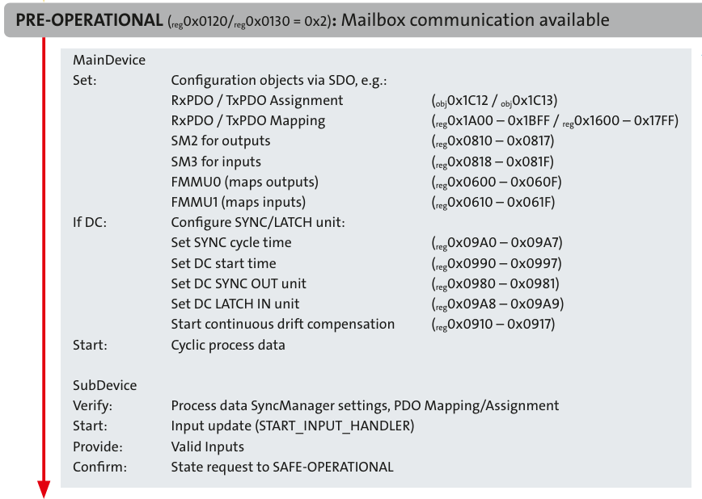
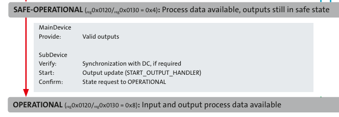

# Chapter 1 State Machine and Register

ETG 協會後來把Master 改名為MainDevice、Slave 改為 SubDevice，不確定是不是因為政治正確而改變，但基於習慣以及統一表示，本系列繼續沿用舊稱，Master 、Slave。

### Preface( Points ):
這一章會介紹State Machine。
如之前所述CoE 最重要的就是OD，OD中最重要的觀念就是Object 跟Index。

* 扯到Index 就免不了討論到Slave 中的Register Address。
* 扯到Register、就免不了討論到MailBox( SDO)、Process Data( PDO )這些資料。
* 扯到資料 就免不了討論到SyncManager( SM )、FMMU。
* 扯到FMMU 就免不了討論回SyncManager( SM )、PDO。

流程大概就以這樣方式進行。

---

### EtherCAT State Machine( ESM )
ESM 中Slave每一狀態的設定，皆為獨立的動作，分成
BOOT、INIT、PreOP、SafeOP、OP。 
Slave要在OP狀態下，才能正式進行資料交握。

由於狀態在OSI 模型中是屬於Application Layer，故暫存器的名稱被命名為: AL
> Note: 如果是Data Link Layer，則命名為DL 或DLL

控制狀態的暫存器( AL Control Register): **0x120**
Master 藉由設定Slave的0x120 暫存器中的數值，切換Slave 的狀態。 如: INIT 為 `0x120 register value = 0x01。`

設定有沒有成功，可以確認，目前狀態的暫存器( AL Status Register): **0x130**
設定0x120暫存器中的資料後，可以回讀0x130暫存器中的數值，確認設定成功。

AL Status Code Register: **0x134**。
0x134用來指出通訊時發生的Error Code。

目前我們知道暫存器( 0x120、0x130、0x134 )的作用。
那麼上述所謂的`Slave的狀態`，到底是什麼。
如下:
簡而言之，Slave 要進到OP狀態下，才能被Master 控制。但在這之前要經歷過INIT、PreOP、SafeOP，最後才到OP，
Boot 通常用於燒錄FW使用。這便就不多做討論了。

* INIT
* PreOP (PRE-Operational)
* SafeOP ( Safe-Operational)
* OP ( Operational )
* Boot

---
### 簡述各狀態的動作:
* INIT
  > * 0x120、0x130 的數值為0x01。
  > * Master的行為: 
  Clear FMMU、SM。
  Set SM0、SM1。
為什麼是SM0、SM1，因為這兩個是讀寫SDO資料的同步管理器。
讀寫SDO機制先起來，然後再去設定PDO相關的Register。  

  > * Slave 的行為:
  驗證SM0、SM1 被設定。
  開始Mailbox 通訊
  確認切換到下一個狀態: PreOP。
  
* PreOP (PRE-Operational)  
  > * 0x120、0x130 的數值為0x02。
  > * Master的行為: 
  設定OD，以及SM2、SM3、FMMU0、FMMU1( PDO 相關的DPRAM)。
  設定Cycle Time。
  週期運作的Process data。

  > * Slave的行為: 
  驗證PDO Assignment、PDO Mapping 完成。
  更新Input 資料(RXPDO)
  回報Input有效。
  確認切換到下一個狀態: SafeOP。

* SafeOP ( Safe-Operational)  
  > * 0x120、0x130 的數值為0x04
  > * Master的行為: Output 有效( 可以開始使用TXPDO )。

  > * Slave的行為: 
  DC 同步對時( 若有啟用的話)
  更新Output 資料(TXPDO)
  
* OP ( Operational )  
  > * 0x120、0x130 的數值為0x08
  > * RXPDO、TXPDO，已可以讀寫。 
  
* Boot
  > * 0x120、0x130 的數值為0x03

簡單來說，當通訊起來的時候，Master會自動去設定0x120切換，Slave 的狀態，設定成不成功，就看0x130 的數值正不正確，如果正確，一路到OP模式。

而在OP之前的這狀態動作，簡而言之:
INIT: 
> Clear FMMU、SM 暫存器。SDO的讀寫機制先起來。不然怎麼去設定FMMU的Mapping。

PREOP:
> Set FMMU、SM 暫存器、Set Cycle Time。開始週期性資料的傳輸。此時RXPDO有效。

SafeOP:
> DC同步生效。此時TXPDO有效。

OP:
> RXPDO、TXPDO可正式使用。

從State Machine 可以知道首重的Register Address是 `0x120、0x130、0x134`。

然後從的各狀態可得知要對0x120設定多少數值、然後回讀0x130作為確認。

講完最重要的起始三個Register Address，
接著我們要討論各個狀態中，其他重要的Register Address。

Note: 以下都以啟用DC 對時功能的說明，

---

### INIT:

在INIT 的狀態，Master 只能存取ESC的Register。
從上述可以得知，主要的工作是Clear  SM、FMMU、設定SDO ( SM0、SM1 )與DC，故相關的Register Address 如下:
* 0x800
* 0x600
* 0x900

單看上圖是看不懂在衝尛的，要搭配 ESC 的架構圖來看，如下:

在DLL( ESC 屬於 Data Link Layer，如果現在對於OSI 7還是沒有概念的小夥伴，建議可以原地放棄本章節，世界很大，時間很短，可以先考慮要不要去聽完張學友的演唱會，再決定要不要從OSI 7 Layter 開始學起。 )

從上圖，Slave 的Memory ( DPRAM ) 可以知道:
* 0x800 :與SM有關的起始位址。SM0、SM1 為MailBox，處理非週期性的資料。SM2、SM1 為Process Data 處理 週期性的資料。
 
* 0x600: 與FMMU 有關的起始位址，處理邏輯位址與物理位址的映射( 就是把資料從Process Data搬到EtherCAT Frame，或從Frame 把資料搬到Process Data 中 )。
資料的一致性是SM管的不是FMMU。
 
* 0x900: 為DC單元的起始位址，舉例來說設定Master Cylcle Time ，是被寫到0x910。

再看一下ESC 架構圖，再想一下之前的話。

---

### PreOP:
這個環節在配置MailBox後。透過SOD的機制再去設定PDO通訊所需的參數。
如PDO Assignment( 用於資料同步管理 )
如PDO Mapping( PDO 中包含哪些變量 )
如設置FMMU、以便完成Master、Slave的PDO映射。
如設定DC以及Cycle Time。

PDO Assign 、PDO Mapping 的概念因為太難懂了，所以再以實際例子做說明:

1. EtherCAT 馬達的位置，因為要每個週期更新，所以是PDO 資料。
2. 依照Cia402 的標準，馬達位置要放在封包0x607A 這個位址。
那麼0x607A 要對應到Process Data ( RXPDO ) 的哪個位址呢?
答案是: 0x1600。
所以`0x1600 <-> 0x607A` 為PDO Mapping。
3. 如果發生Master、Slave 同時操作0x1600的話，將出現資料的一致性問題。所以要透過同步管理器負責。
同步管理器的位址為0x1C12，管理0x1600 的資料，確保其中的資料一致性。
所以`0x1C12 <-> 0x1600` 為PDO Assignment。(for RXPDO )

以上的說明是用實務經驗往回推，但在通訊上則是先PDO Assignemt 再 PDO Mapping。

故相關的Register Address 如下:
* 0x1C12、0x1C13: RX/TX PDO Assignment Start Address。
* 0x1A00、0x1600: RX/TX PDO Mapping Start Address。
* 0x910: Cycle Time Address。

---

### SafeOP、OP:
這個兩個階段並未對Register 做操作，故無重要的Register可介紹。

---  
  ### 小結:
  這章的內容硬了一點。主因是State Machine 脫離不了Register、其中還須了解各Register 的用途與編號，以及哪個State中發揮作用。

  但至此也補充了可以之後可以分析封包的概念:
至少目前可以做到:

1. 可以從封包中找尋0x120、0x130的Address確認再該時間下，Slave的狀態。
 
2. 可以從0x134確認通訊過程中有無發生ERROR。
    
3. 可以從0x910 獲取Cycle Time，並從封包的間隔時間，推估Cycle Time 合不合理( Note: 需專用的封包分析儀擷取封包 )。

下一章節，主要以偵錯、排錯的Error Diagnosis為主。
光講理論沒用對吧，在問題大爆炸後，被釘在牆壁上的時，還是要有拆彈的能力，所以會從排錯的診斷手法，繼續解釋，重要的Register。

因為:
> 如之前所述CoE 最重要的就是OD，OD中最重要的觀念就是Object 跟Index。

> * 扯到Index 就免不了討論到Slave 中的Register Address。

> * 扯到Register、就免不了討論到MailBox( SDO)、Process Data( PDO )這些資料。

> * 扯到資料 就免不了討論到SyncManager( SM )、FMMU。

> * 扯到FMMU 就免不了討論回SyncManager( SM )、PDO。

重要的事情，多說幾遍。OD 觀念很重要。

---

#### Reference:
<https://www.ethercat.org/download/documents/EtherCAT_Device_Protocol_Poster.pdf>

<https://college.xinje.net/wp-content/uploads/2021/05/2021052800172988.pdf>