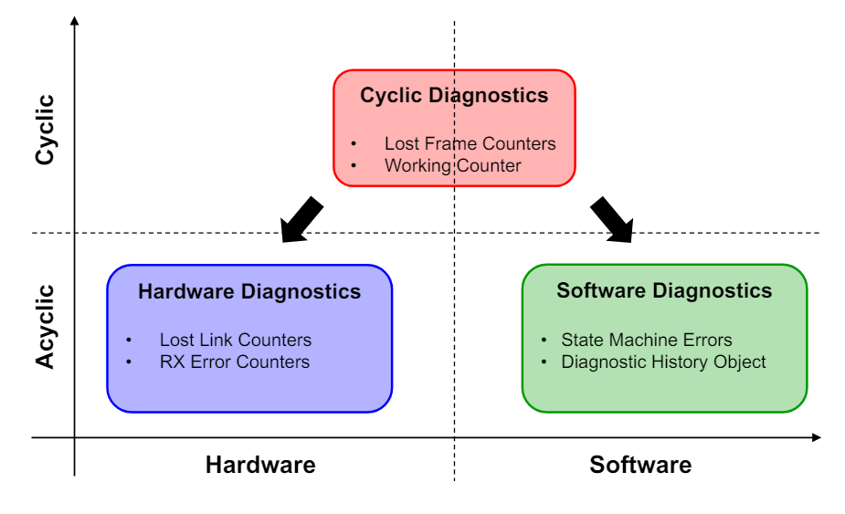
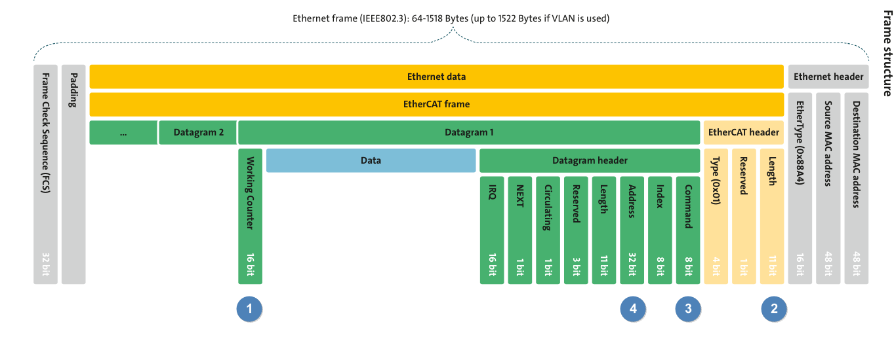
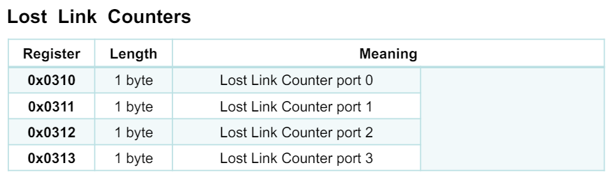
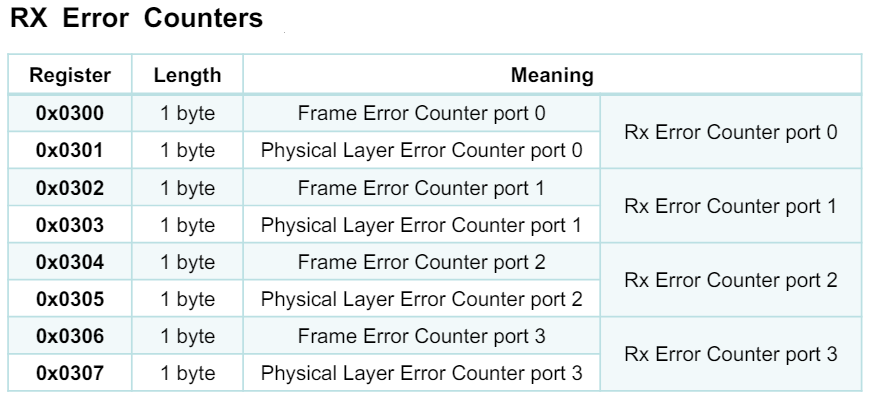
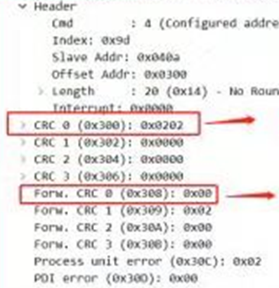
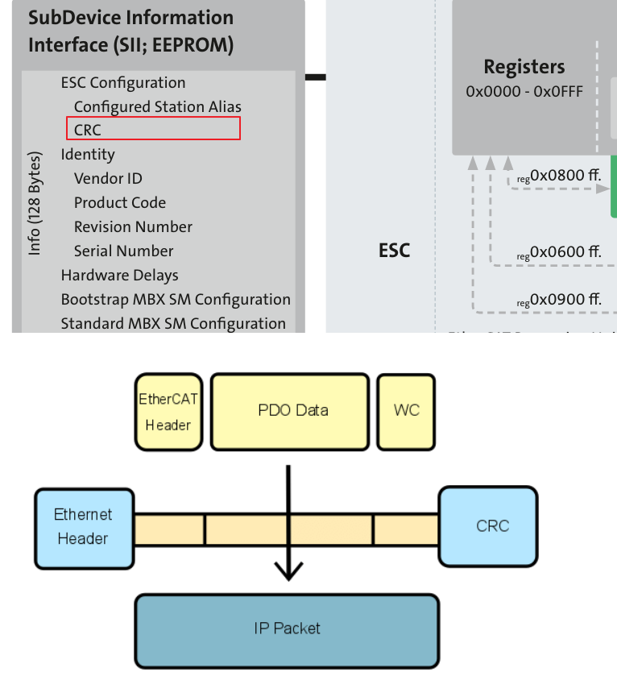
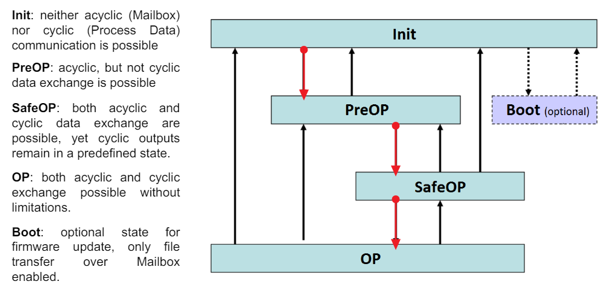
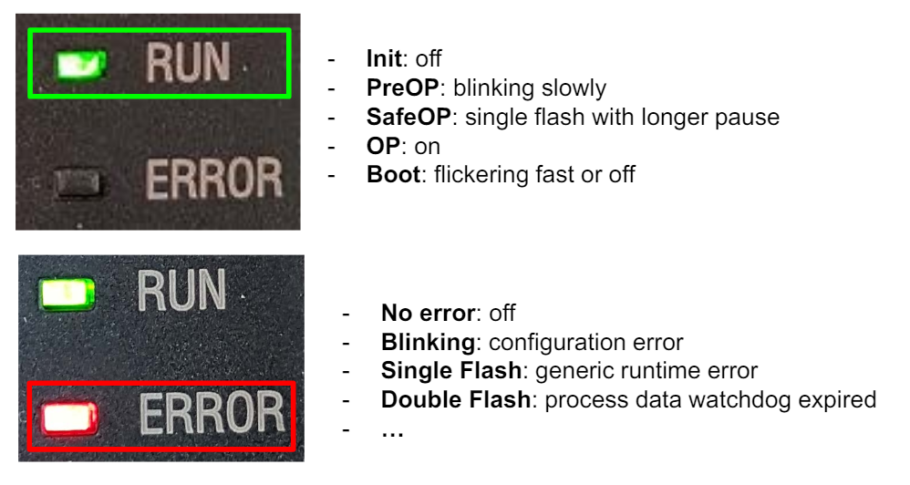
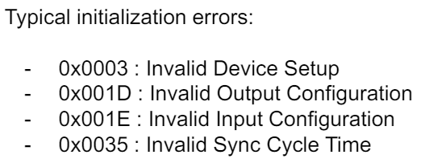
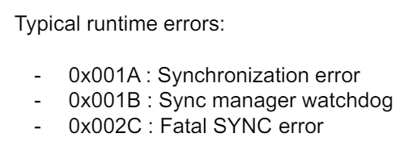

# Chapter 2 Diagnosis

### Preface( Points ):
畢竟本系列文章的目標還是在實務上，所以不會提到太理論的部分。以下是我對於實物的定義:
`可以派上用場。`

**舉例**:
在前線Support時，被鯛魚幹譙說還要多久，為什麼大家還不能下班。

在六神無主洗臉的場景，閱讀本文的施主，心中還有一絲的護身咒，可以回嗆，比如:
* 阿幹! 你就沒開DC 對時啊，位置就有可能會不準啊。 
* Error Counter 飆高那麼多，通訊品質不佳當然有問題啊。

如果寫本系列的文章，可以藉由宇宙力量，獲得一個願望的話，希望沒有在前線蹲點過，站著說話不腰疼的場內鯛，可以蹲個一個禮拜，感受一下`ㄎㄨˊ落ㄎ一ˇ`的腰部張力以及被洗臉的威力，減少說風涼話的症頭。

--- 

### What are Errors
( 英文標題 只是為了轉換心情，避免睡著 )

前章所述State Machine的五種State，都可以藉著在Slave 上的LED的閃爍方式，判斷目前的State。

至少在無法連線的情況下可以先判斷Slave 有沒有進到OP Mode。

不過，只會這一招也只會被洗臉洗到爆。
所以我們必須先區分Error的種類以及排錯的手法。
分類如下:

* Hardware Errors:
  * 物理層出現問題，使網路通訊中斷，Slave 無法收到資料，資料無法回傳Master，比如網路線被拔除了。
  * 所有的Slave 都有收到封包，但封包毀損。比如EMC干擾造成的CRC Error。
* Software Errors
  * 可來自於Synchronization loss、watchdog expiration.
   
  * 比如Master 在Start-up 層面就出了問題，比如設定了沒支援的Cycle Time。錯誤的Process Data Size或錯誤的 Process Data Configure。  
  **舉例來說**:
  之前有EtherCAT Driver 的PDO 不照Cia402走，所以PCI-1203(Master) 要為其客制一版，讓PDO Size 正確，才能完成連線。
  最後在Utility 建立設定PDO 的CheckBox List(預設是全部勾選，勾選表示配置該PDO參數)，俗稱勾勾表，在連線不上時，從Slave 的手冊確認那些PDO是沒有Supported，然後透過手動的方式，取消該項PDO的配置，以便可以正常連線。

[ Note ]
勾勾表不能說難用，只能說超級難用。
會用這樣的方式的理由是因為，當時Master不支援匯入ESI，所以Master 是假設所有的Driver 都按照Cia402 規定的PDO 都有支援。故無法從ESI先得知Slave 的PDO Configure。
當後續PCI-1203 在2.0之後支援ESI 匯入後，勾勾表也走入了歷史。

如果還是不懂舉例說明的，更簡單來說:
ESI跟Slave EEPROM，內容不一致，會造成PDO Mapping 錯誤，所以無法連線。

在更簡單來說:
ESI、EEPROM的舉例還是不懂，要不要考慮先去聽張學友的演唱會。聽完之後再好好的思考一下。

---
### Diagnostic Infomation
診斷的資訊可以簡單分類( 如下圖所示):
**即:封包有問題，不是軟體就是硬體。**

**週期性診斷**:
1. Lost Frame Counters 有沒有增加。
2. Working Counters ( WKC )是不是正確。
   
**硬體診斷**:
1. Lost Link Counters 有沒有增加。
2. RX Error Counters 有沒有增加。
   
**軟體診斷**:
1. State Machine Errors.
2. 之前操作、存取的Object 有無問題。

以下將詳述上述的三種診斷方式:

---
### 週期性診斷( Cyclic Diagnostic )
EtherCAT 封包，中要傳給Slave 的資料都存在名為Datagram 的區塊內類。
Datagram的最後兩個Byte就是放置Working Counter ( WKC )的數值。如下圖 (1)。

WKC 的作用，在於封包每經過一站，便會對WKC 進行一次計數，假設計數的數值與預期不符，則表示有問題。

WKC計數的公式如下:
**讀**操作: 成功 +1、失敗+0
**寫**操作: 成功 +1、失敗+0
**讀+寫**操作: 
讀成功 +1、
寫成功+2、
讀+寫成功 +3
失敗+0

所謂的操作，有個更正式的名稱:EtherCAT Command。 故更正確地來說，WKC是看EtherCAT Command 有沒有完成。

**舉例來說**:
Master 連接三台Slaves。
Master第一步會下EtherCAT Command : BRD
讀取網絡上所有Slaves的AL Status。

BRD( Broadcast Read)。我們可以得知這是讀的操作。
因此 WKC  = 3。
可想而知如果WKC 不等於3，那麼一定是有問題的。

這邊只提WKC 的概念。也就是WKC出問題時，可以從WKC推測出在哪一站或多少站出問題，可能是被Reset或不在OP Mode，Master 執行什麼EtherCAT Command 時有了狀況。

這邊暫時不說明EtherCAT Command，待後續章節再進行說明。
不論如何，當WKC 計數不符預期時，應繼續深入分析問題，診斷問題是屬於硬體還是軟體哪個層面。

---
### 硬體診斷( Hardware Diagnostic )

**從Master 的角度看偵錯**:
Master Lost Frames Counter:
Master 發送封包給Slave，但是Slave 未在預期時間內收到，或未回應Master，則視為Lost Frame。

一般常見的Master廠商(ex: TwinCAT )都會針對Master Lost Frame 提供診斷工具。
或使用封包分析儀也可以進行檢測。

**從Slave 的角度看偵錯**:
Slave 的Error Counter 被記錄在Register中只要透過Register Addresses即可讀取。如下:

Slave 中的RX Error Counters ，可以在回傳的封包中獲得，名為 CRC( Cyclic Redundancy Check )，也就是上圖的Frame Error Counter。

用Wireshark 的封包資料如下:

DPARM與Frame比較示意圖如下:

---
### 軟體診斷( Software Diagnostic )
這邊就要再次提到前章的，State Machine。
Master 連上Slave 時，透過設定Register 0x120，逐步切換Slave State。
當Slave State = OP時，正式進行資料交握。(如下圖紅箭頭)。

此時若要檢查Slave狀態( AL Status )可讀取Register 0x130。
或者透過Slave 上Run 燈的閃爍方式，判斷當前Slave State。

簡而言之，如果在設備要運作時，Slave還不在OP Mode 都是有問題的。

同時，Slave 的Error 燈的閃爍方式，可判斷當前Slave 的問題屬性。

簡而言之，如果在設備要運作時，Error LED = ON都是有問題的

每當出現Error時，AL State Code 都會被記錄在Register 0x134 中。
其中 0x134紀錄的Error Code 分為
* Initialization Errors:  
為Start-up( 到OP之前出現 )的錯誤。Slave 因某些條件未達成而拒絕Master 的通訊請求。常見的Error Code 如下:

發生Initialization Errors時，你可以確認:
1. Slave 的預設設定可能被改變，在CODESYS為例，修改Alias Address後，最好會刪除Device 然後重新Scan。
2. ESI與Slave 的EEPROM 內容有無一致，如果不一致，將造成Master 在配置時錯誤。
3. 模組連接有無問題。
4. Slave DC同步問題，Jitter 過大也有可能造成無法連線，所以可放寬Cycle Time的設定。舉例來說: PCI-1203 只連接IO 模組Cycle Time 可以支援200us。但如果是EtherCAT Driver，則需500us。Cycle Time 太快有可能連不起來。

* Runtime Errors:
Slave 自動地從OP跳到其他State，Slave 在操作過程中偵測到錯誤並自發性的，在沒有Master 的命令下跳轉至其他狀態。常見的Error Code 如下:

發生Runtime Errors時，你可以確認:
1. 先確認Error Counters有無數值遞增，排除硬體問題。
2. 確認Master 正常執行中。
3. 確保Jitter 若大於Cycle Time 的20~30%
   
---  
### 小結:

對於初學者來說看到一串十六進位的數字時，短時間內不容易辨識出，這串數字要表達的是Register、OD、Error Code。
建議就接受這個現實吧。不然前幾章一直在說OD 很重要，是在說辛酸的嗎?`工新ㄊㄟˋ給空ㄟ嗎?`

Chapter 1: 
以State Machine入手，講述重要的Register Address、在這一章至少有了Register Address 很重要的觀念。為OD 建立了基礎。

Chapter 2 : 
以Registger Address為基礎，講述了偵錯的方法。

截止目前Register Address，我們說的都是Slave 端的東西。
那 Master 端的封包呢，有沒有需要注意的Address。
又與前面提到的EtherCAT Command :
BRD( Broadcast Read) 又有什麼關係呢?

有，下一章節就是以Master 為主來討論。
既然是以Master為主，貫穿通篇文章的中心思想就是: 封包( Frame )。
  
---

#### Reference:
<https://www.ethercat.org/download/documents/EtherCAT_Diagnosis_For_Users.pdf>

https://blog.csdn.net/gufuguang/article/details/119889835

https://blog.csdn.net/weixin_42118352/article/details/125971649?ops_request_misc=%257B%2522request%255Fid%2522%253A%2522171937024916800180618696%2522%252C%2522scm%2522%253A%252220140713.130102334..%2522%257D&request_id=171937024916800180618696&biz_id=0&utm_medium=distribute.pc_search_result.none-task-blog-2~all~baidu_landing_v2~default-2-125971649-null-null.142^v100^control&utm_term=EtherCAT%20jitter&spm=1018.2226.3001.4187

https://blog.csdn.net/weixin_43925069/article/details/121841050?ops_request_misc=%257B%2522request%255Fid%2522%253A%2522171937020716800185862626%2522%252C%2522scm%2522%253A%252220140713.130102334..%2522%257D&request_id=171937020716800185862626&biz_id=0&utm_medium=distribute.pc_search_result.none-task-blog-2~all~baidu_landing_v2~default-1-121841050-null-null.142^v100^control&utm_term=maximum%20jitter&spm=1018.2226.3001.4187