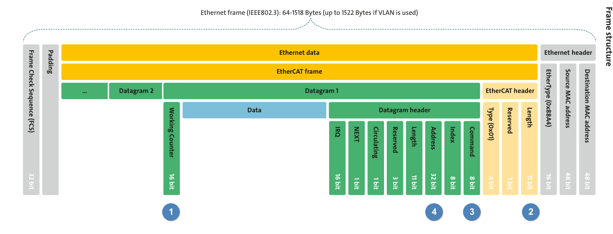

# Chapter 3 Frame

### Preface( Points ):
為了避免後續講解困難，所以先梳理一下名詞問題:
對於使用者來說，數據就是資料，傳出去收回來，如此簡單明瞭。

但是數據在不同層面、不同應用被賦予了不同的名詞，名詞混淆一直是學習EterCAT 的業力輪迴，因為涵蓋的知識層面太廣，因此假設只會工控設備的應用，但沒碰過通訊開發，在某些觀念上，就會處於
**ㄊㄟˊ酒陶共覽%** 做白工的輪迴。

Data link layer 發出的數據為Frame。
Network Layter 發出的數據為Packet。
Transpot Layer 發出的數據為Segment。

以下以Ethrnet 舉例:( 不是EtherCAT 喔)

Datagram表示其資料格式中有Header 與Data。
在Network Layer 中為一個或多個Packet 的集合。

不過在EtherCAT 的OSI layer 中只有Data link Layer，所以正式名稱應該叫Frame。
Datagram 則是包含在Frame 中的資料。

---
### Datagram:

如下EtherCAT 封包的結構。
在Ethernet 的架構下，包含作為通訊使用的資料(EtherCAT Data)，這部分因為是封包的關係故名為:
EtherCAT Frame。

Frame 由 Header、多個Datagram組成。
Header 說明Data的基本資訊。
Datagram中包含給予Slave的命令。以及前章說到用於偵錯使用的WKC。 

下圖:
( 1 ) WKC
( 2 ) EhterCAT Header Length: Datagram 資料總長。補充一點EtherCAT 有四種Protocal，這部分的訊息就寫在Type，如CoE。
( 3 ) Datagram Command: 要對Slave 進行操作的命令。

( 4 ) Address: 
封包要發給誰，要怎麼找出對應的Slave。
常用四種尋址方式來存取Slave。尋址方式的不同，所以Master下的EtherCAT Command 也有所不同。

**常用四種尋址方式**:
1. Position Address  
又名: Auto-increment Address。
2. Node Address  
又名: Configured Station。  
又名: Configured Station Alias。
3. Broadcast Address
4. Logical Address

---
在此先概述上述的四種方式，然後再展開詳解。

我們先把Address 看成ID 好了。
Slave 的 ID，是照串接順序遞增給予ID，第0台就是0，第一台就是1，以此類推。

觀念很好懂，但實際上並不是這麼簡單，還要再繞一圈，
`Slave 在收到Auto Increment Command 時，Address 中的ADP = 0，才執行命令`。

所以Master 下命令時，ADP( Address Position )並非寫入Slave是第幾台，而有可能一開始是負值。每經過一台ADP就+1，直到，到了目標Slave後，ADP 剛好等於0，才執行命令。此動作為**Position Address**。

如果Slave 上有硬體的旋鈕可設定 Device ID，則會把Device ID 寫入到Register中，這部分是在Start-up 時由Master 完成，Slave 並不能做更改，但是，Slave 可以另外建立別名( Alias Address)，這部分的數值可被儲存到ESI、EEPROM中。透過Device ID、Alias Address來設定特定Slave 的SDO。此動作為**Node Address**。

**Broadcast Address**:
因為是對網絡上所有的站操作，所以不用尋址。

如果上述的動作都是要透過Address 來設定SDO。那PDO呢?
從之前的章節可以知道、透過FMMU的PDO Mapping，就可以實現PDO Data 的資料交握。
透過FMMU 其中的位址資訊進行資料交握，此動作為**Logical Address**。

簡而言之:
前三項讀寫Register、SDO用。最後一項讀寫PDO用。

不同的尋址方式，對於Frame 的Address 其中的組成有有所不同，如下圖:

以下逐一說明:

---
###  Position Address:
Slave 收到Datagram後，命令如果是Auto Increment，且ADP = 0，則執行EtherCAT Command.
封包出站後會ADP會加1，所以收到ADP =1 的Slave 因為ADP 非0 的關係，故不會執行命令。
EX:
要控制第0台，則ADP = 0。要控制第2台，則ADP = -2 開始，故第台收到ADP = -2，第一台ADP = -1，第二台收到ADP = 0。

ADO 是 OFFSET，紀錄ESC 的Local register Address或 Memory Address。
要設定的數值則記錄在Datagram的Data 中。

---
###  Node Address:
相較於Position Address 的操作，這部分觀念就比較簡單了，使用Slave被配置的地址進行資料操作。
如:單獨對某個Slave的SDO進行讀寫。
Slave收到 Node Address 相關的命令時，會把ADP的數值與EEPROM比較，如果匹配( Device ID 或Alias Address )，則進行讀寫。
ADO則為Register Address。

---
###  Broadcast Address:

ADP 不用於尋址，但每經過一站Slave 會對ADP +1，
ADO 為Register Address。 
如讀Slave 的AL Status。故可從Respont Frame查看ADP了解哪一站目前有沒有進到OP ( ADO = 0x130 )

---
###  Logical Address:
前面說的基本上都是SDO 、Register 的操作。
這部分就要說PDO。
封包Header 中這邊就沒有ADP、ADO了，就只有Local Address。
如果Slave 的FMMU 位址與 Local Address 相符，則針對該台Slave，其FMMU的映射關係，讀寫PDO 數值。

以下範例說明:
封包在下LRW 命令時的Logical Address 是0x1000000。
而 Slave 1 的FMMU 的Logical Address 剛好是0x1000000。

所以知道命令是針對Slave 1的PDO 讀寫。
FMMU Logical Address 存放在暫存器0x06y0 中。
Slave 1的物理位址0x1800，0x1C00。

再重溫一下PDO觀念。

後面的十六進制是 SM2 OD Index 跟 SM3 OD Index。

SM2:
RXPDO Assignment ( 0x1C12 )
RXPDO Mapping ( 0x1600)
RXPDO Input Data (  0x6000)

SM3
TXPDO Assignment ( 0x1C13)
TXPDO Mapping ( 0x1A00)
RXPDO Output Data ( 0x7000)

---
###  EtherCAT Command and WKC:
EtherCAT Command 如下，就算目前我們還不會分析封包，至少知道BXX 命令用來問AL Status、FPXX、APXX 命令操作SDO，LXX 命令操作PDO。

命令是否執行成功，就看WKC

---

---  
### 小結:
這邊要坦誠地面對大家，Logical Address的機制，我還不懂，所以這段大家應該也覺得敘述有點懵懵懂懂的，只能盼望後面有大神可以修正目前的文章了。

Level 2 的系列，這就是最後一章了，至此，補上最後一塊知識拼圖，如這一系列一開始所述，EtherCAT 牽涉的範圍甚廣，這邊只概述一些重點，還有很多的觀念這邊沒說，以避免自亂陣腳，如:

1. 對時機制( DC Mode 、SM Mode)。
2. ETG 規範( Cia 402 、PP Mode 、CSP Mode)
3. EtehrCAT Package Analysis。

後續的Level 3 Tutorial 會再逐步說明  

---

#### Reference:
https://blog.csdn.net/u014453443/article/details/134143553?ops_request_misc=%257B%2522request%255Fid%2522%253A%2522171937215216800185811185%2522%252C%2522scm%2522%253A%252220140713.130102334..%2522%257D&request_id=171937215216800185811185&biz_id=0&utm_medium=distribute.pc_search_result.none-task-blog-2~all~sobaiduend~default-2-134143553-null-null.142^v100^control&utm_term=EtherCAT%20Datagram&spm=1018.2226.3001.4187

https://blog.csdn.net/weixin_45682319/article/details/131712047?ops_request_misc=&request_id=&biz_id=102&utm_term=FMMU%200x1800&utm_medium=distribute.pc_search_result.none-task-blog-2~all~sobaiduweb~default-2-131712047.142^v100^control&spm=1018.2226.3001.4187

https://blog.csdn.net/kewbblog/article/details/9135551?ops_request_misc=&request_id=&biz_id=102&utm_term=Frame%20Package&utm_medium=distribute.pc_search_result.none-task-blog-2~all~sobaiduweb~default-0-9135551.142^v100^control&spm=1018.2226.3001.4187

https://infosys.beckhoff.com/english.php?content=../content/1033/tc3_io_intro/1257993099.html&id=

